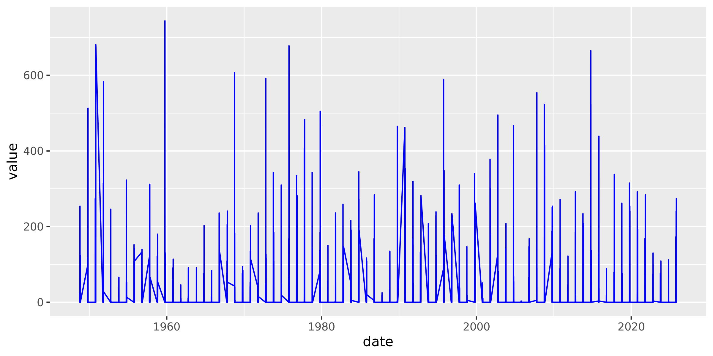

<link rel="preconnect" href="https://fonts.googleapis.com">
<link rel="preconnect" href="https://fonts.gstatic.com" crossorigin>
<link href="https://fonts.googleapis.com/css2?family=Montserrat&display=swap" rel="stylesheet">


```{r echo = FALSE, message = FALSE}
library(lubridate)
```

```{css echo = FALSE}
.author, .title {
  display: none;
}

.main-container {
  max-width: 100%;
}

body {
  background-color: black;
  color: #f5f5f5;
  font-size: 1.2vw;
  font-family: "Montserrat", sans-serif;
}
```




Last updated on `r today()`  
Site [developed](`r rmarkdown::metadata$github_repo`) by [Ryan Jackwood](mailto:`r rmarkdown::metadata$email_address`)

<p style="color: black">`r now()`</p>